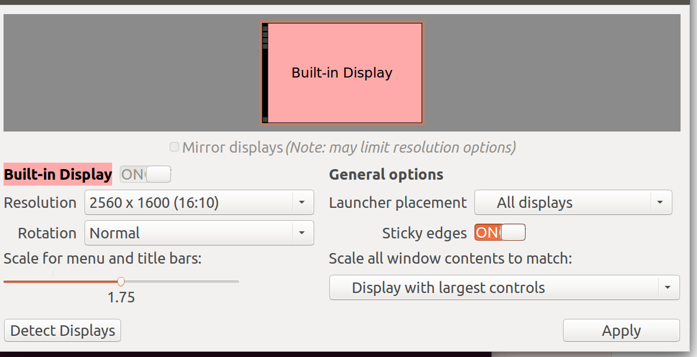

## Installing Ubuntu 15.04 on a MacBook Pro (11,1)

This tutorial will create a **fully disk encrypted** Macbook running **only Ubuntu 15.04**. This will **completely remove your OS X partition**.

Your model version should be `MacBookPro 11,1`. You can verify this from OS X by following [Apple's steps here](http://support.apple.com/kb/ht4132), or by running `sudo dmidecode -s system-product-name` from Ubuntu.

You will need:

* A **USB flash drive** with at least 2GB of storage.
* Some sort of **wired connection**, at least briefly, to install wireless drivers. This can be Ethernet (through an Ethernet-to-USB adapter), or it could be USB tethering from a device connected to a mobile network.
* **These instructions**, either printed on paper (!), or visible from your phone or another laptop.

You can create the Ubuntu boot USB stick [from OS X](#starting-from-os-x), or you can do it [from Ubuntu](#starting-from-ubuntu).

### Starting from OS X

From the [Ubuntu Desktop download page](http://www.ubuntu.com/download/desktop/), download 15.04 LTS **64-bit**. Download the *normal* 64-bit ISO. Do **NOT** download the "64-bit Mac (AMD)" version.

Now we'll convert the `.iso` to the kind of `.img` file that Macs need to boot from.

`cd` to the directory where the `.iso` file lives, then run:

```bash
hdiutil convert -format UDRW -o ubuntu-15.04-desktop-amd64.img ubuntu-14.04-desktop-amd64.iso
```

OS X will actually output a `.img` with a `.dmg` extension added, so remove it:

```bash
mv ubuntu-15.04-desktop-amd64.img.dmg ubuntu-15.04-desktop-amd64.img
```

Insert the flash drive. Then find the identifier of the flash drive (e.g. `/dev/disk2`), by running:

```bash
diskutil list
```

Unmount the flash drive (replace `/dev/diskN` with the disk identifier you discovered above):

```bash
diskutil unmountDisk /dev/diskN
```

Then flash the `.img` to the drive. Use your disk identifier from above, but note the extra `r` that gets put in the middle.

```bash
sudo dd if=ubuntu-15.04-desktop-amd64.img of=/dev/rdiskN bs=1m
```

Eject the drive:

```bash
diskutil eject /dev/diskN
```

Then actually remove the drive.

### Starting from Ubuntu

From the [Ubuntu Desktop download page](http://www.ubuntu.com/download/desktop/), download 15.04 LTS **64-bit**. Download the *normal* 64-bit ISO. Do **NOT** download the "64-bit Mac (AMD)" version.

Figure out the correct device identifier for the USB drive. It may be `/dev/sdc`, or `/dev/sdd`, etc. If you already run Ubuntu, I'm trusting you to figure out how to identify the USB stick's identifier.

Create a USB stick by running the following command, replacing `/dev/sdX` with the device identifier you found:

```bash
sudo dd if=ubuntu-15.04-desktop-amd64.img of=/dev/sdX
```

### Booting Ubuntu from USB

Reboot your computer, **and hold** the `Alt/Option` key during boot. The menu to select a boot device should appear.

You should see two hard-drive-like icons on the left, which are OS X and the OS X recovery partition. On the right, you should see 1 or 2 USB icons, labeled "EFI Boot".

If you see 2 USB icons, it shouldn't matter which one you pick. But if you want more peace of mind, you can unplug and replug in the USB drive, and only 1 should reappear.

Select the USB icon to enter into the Ubuntu GRUB selector. Pick **"Try Ubuntu without installing"**. Do *not* pick "Install Ubuntu" -- you will want to run some commands after installation but prior to rebooting.

### Installing (from fake Ubuntu)

Once inside the flash-booted Ubuntu, you may notice that the screen is not well-scaled for the high-density screen. You can fix that if you want by [following the instructions below](#high-density-display), but you'll have to do it again after install anyway.

You will need to install wireless drivers from the network. This means you will need a **wired connection**. This could be Ethernet (using an adapter), or it could be over USB tethering (many Android phones, such as the Nexus 5, support this out-of-the-box).

Install drivers with:

```bash
sudo apt-get install bcmwl-kernel-source
```

The wireless should start working right away. If tethering, you may wish to disconnect the tethered device.

Start the installer from the "Install Ubuntu" desktop launcher. When asked how to install Ubuntu on the hard drive, elect to erase all operating systems and install Ubuntu 15.04.

When installing Ubuntu, pick the option to encrypt your hard drive during install. This will auto-select an option about LVM as well, which is fine.

During installation, select the option to wipe the entire drive, even unused blocks -- even though the installer says this may make installation take much longer. It won't take that long.

### Post-installation fixes (from real Ubuntu)

#### Fix the wireless

Install those wireless drivers again:

```bash
sudo apt-get install bcmwl-kernel-source
```

#### GRUB maintenance

The second GRUB change fixes a reported occasional SSD freeze bug. (I've never seen it, but I'm following orders out of an abundance of caution.)

```bash
sudo nano /etc/default/grub
```

Change the `GRUB_CMDLINE_LINUX=""` line to read:

```
GRUB_CMDLINE_LINUX="libata.force=noncq"
```

Finally, save and update GRUB to make those two changes take effect:

```bash
sudo update-grub
```

#### High density display

You'll notice that the retina display makes everything tiny. Fix this by going to your `System Settings`, then to `Displays`. Change the "Scale for menu and title bars" from `1` to `1.75`.



#### Adjusting the trackpad

To make the trackpad a little smoother and more like OS X (and less likely to pick up on palms and thumbs), switch out the `synaptics` driver for the `mtrack` driver and put in a profile that should be pretty close to OS X.

Swap out the driver:

```
gsettings set org.gnome.settings-daemon.plugins.mouse active false
sudo apt-get install xserver-xorg-input-mtrack
sudo apt-get autoremove xserver-xorg-input-synaptics
```

Then edit `/usr/share/X11/xorg.conf.d/50-mtrack.conf` and replace its contents with this:

```
Section "InputClass"
 MatchIsTouchpad "on"
 Identifier "Touchpads"
 Driver "mtrack"
 Option "IgnoreThumb" "true"
 Option "ThumbSize" "50"
 Option "IgnorePalm" "true"
 Option "DisableOnPalm" "false"
 Option "BottomEdge" "30"
 Option "TapDragEnable" "true"
 Option "Sensitivity" "0.5"
 Option "FingerHigh" "3"
 Option "FingerLow" "2"
 Option "ButtonEnable" "true"
 Option "ButtonIntegrated" "true"
 Option "ButtonTouchExpire" "750"
 Option "ClickFinger1" "1"
 Option "ClickFinger2" "3"
 Option "TapButton1" "1"
 Option "TapButton2" "3"
 Option "TapButton3" "2"
 Option "TapButton4" "0"
 Option "TapDragWait" "100"
 Option "ScrollLeftButton" "7"
 Option "ScrollRightButton" "6"
 Option "ScrollDistance" "100"
EndSection
```

#### Switching Alt and Cmd

If you're like me, you want the left-hand modifiers to go `Ctrl`/`Super`/`Alt`, and not `Ctrl`/`Alt`/`Super`, the way Mac keyboards default to.

To do that, make a file at `~/.xmodmap` that contains the following:

```
clear control
clear mod4
clear mod1

keycode 64 = Super_L
keycode 133 = Alt_L Meta_L

keycode 134 = Alt_R Meta_R
keycode 108 = Control_R

add mod4 = Super_L
add mod1 = Alt_L Meta_L
add mod1 = Alt_R Meta_R
add control = Control_L
add control = Control_R
```

You can test this out immediately by running `xmodmap ~/.xmodmap`, but this will only make it last until the next time you reboot.

To enable it every time you boot, create a file at `~/.config/autostart/switch_keys.desktop` with the following:

```
[Desktop Entry]
Name=Set Keyboard
Exec=xmodmap /path/to/.xmodmap
Terminal=false
Type=Application
```

**Note:** Change `/path/to/.xmodmap` above to the actual absolute path to your `.xmodmap` file. You can't use `$HOME`.

### Making Function keys work without Fn

By default, the Function keys (F1, F2, etc.) will do things like turn brightness up and down, and if you want to actually input F1 or F2, you need to hold down the Fn key. This applies to all 12 Function keys.

If you want to flip the behavior, create a new file:

```bash
sudo nano /etc/modprobe.d/hid-apple.conf
```

Whose body is the following one line:

```
options hid-apple fnmode=2
```

The next time you boot up, the behavior will be flipped, and you will need to hold down Fn to turn brightness up and down.

### Reference resources

I used these while figuring all this out:

* [Ubuntu official instructions for creating a bootable USB stick](http://www.ubuntu.com/download/desktop/create-a-usb-stick-on-mac-osx)
* [Ubuntu wiki instructions for 13.10/14.04 on MacBook Pro 11,1](https://help.ubuntu.com/community/MacBookPro11-1/Saucy)
* [Ubuntu wiki instructions for 14.10 on Macbook Pro 11,1](https://help.ubuntu.com/community/MacBookPro11-1/utopic)
* [Remapping your keyboard](http://www.chrisamiller.com/blog/posts/remapping-your-macbooks-keyboard-in-ubuntu-1204)
* [Running commands on startup](https://askubuntu.com/a/463280)
